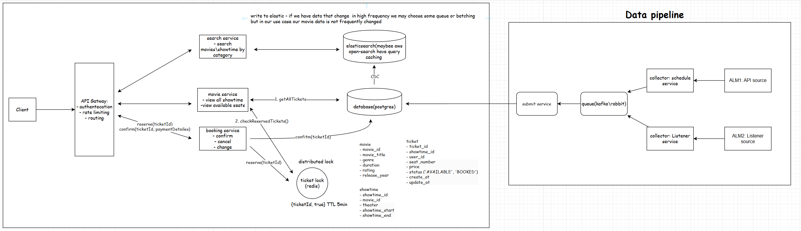

# Booking Movie Ticket APIs Spring Boot Project

This project is a Spring Boot implementation of the backend APIs for a ticket booking system. It provides a set of RESTful APIs that enable client applications to interact with the ticket booking system and perform various operations.
## High Level Design (not all implemented)

## Functional Requirements
- Book Tickets
- View an movies (choose seat, etc)
- Search  for movies

## Non-Functional Requirement
- strong consistency for booking ticket (no double booking)
- high availability for search and viewing movies
- more reads then writes

## Assumpstions:
- this structure assumes the ALM systems provide movie and showtime data alongside ticket data,
  either explicitly or implicitly (e.g., via references in the ticket data).
- more reads than writes
- data from ALM in the following structure [json data](src/main/resources/data_example.json)
- I used unique constraint to ensure no seat is booked twice for the same showtime. in production we will be use distributed locking with redis
- in production the booking machination will be in two phases -> reservation, and confirmation(booking)
- regarding normalized vs. denormalized schema in postgresql, although it's not a unified table as the task require. I think it more best practice to maintain normalized approach cause data consistency is harder to maintain in denormalized approach.
  if reads will become a bottleneck we can consider materialized view or move data to cache system.

## Features
* Ticket Booking -> Users can browse through the available movie, select the desired event, and book tickets for it.
* Seat Selection -> Users can choose their preferred seats from the available options for a selected event.
* Booking History -> Users can view their booking history and check the details of their past bookings.

## Technologies Used
* Java 17+
* Spring Boot 3.2.3
* Spring Data JPA
* Postgresql17 (as the database)
* Maven (for dependency management)

## Getting Started
To set up the project on your local machine, follow these steps:(in production it will be in docker and pod.yaml file if it's running on k8s cluster)

1. Clone the repository: `git clone https://github.com/reisivan1993/atnt-assignment.git
2. Navigate to the project directory
3. Configure the database settings in `application.properties` file.
4. Create db: `psql -U postgres -c "CREATE DATABASE ticket_booking_db;`
5. Run tests: `mvn clean test` 
6. Build the project using Maven: `mvn clean install`
7. Run the application: `mvn spring-boot:run`
8. The application will be accessible at [http://localhost:8080](`http://localhost:8080`).
9. I tried to prepare docker-compose, but unfortunately its new computer, so I didn't want to waste time on that

## Database Setup
This project uses Postgresql as the database. Follow these steps to set up the database:
1. Install Postgresql on your local machine.
2. Create a new database named ticket_booking_db.
3. Update the database configuration in `application.properties` file.

## API Documentation
The API documentation for this project can be found at [http://localhost:8080/swagger-ui.html](`http://localhost:8080/swagger-ui.html`). It provides detailed information about each API, including request/response formats and parameters.
#### Note: in order that api will work data should be in the database(I didn't create dataGenerator class that will populate the db) 